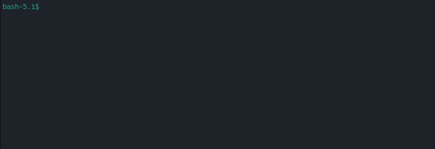
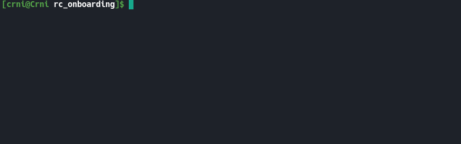
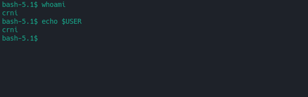
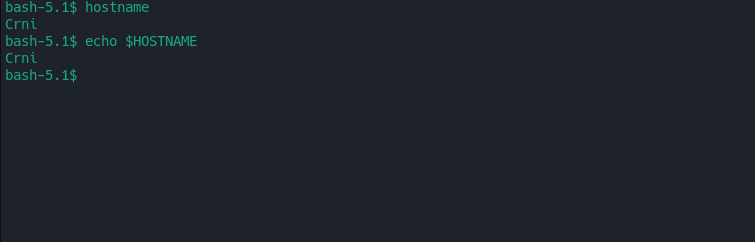
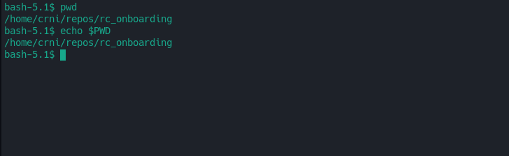
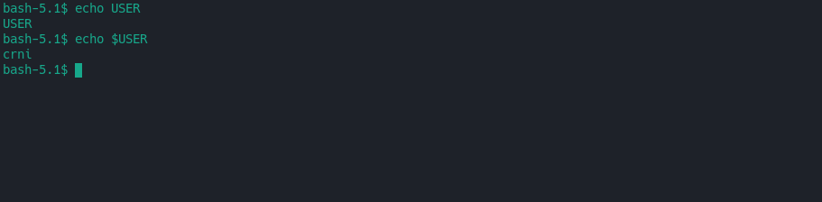
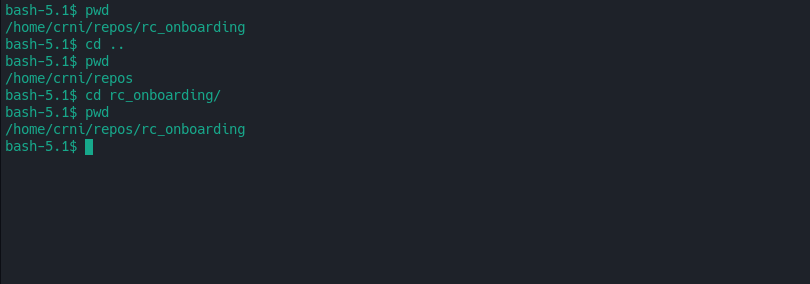
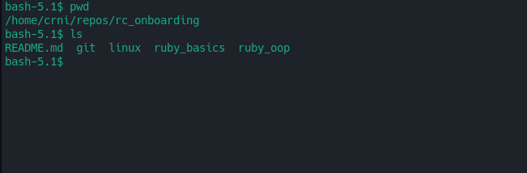
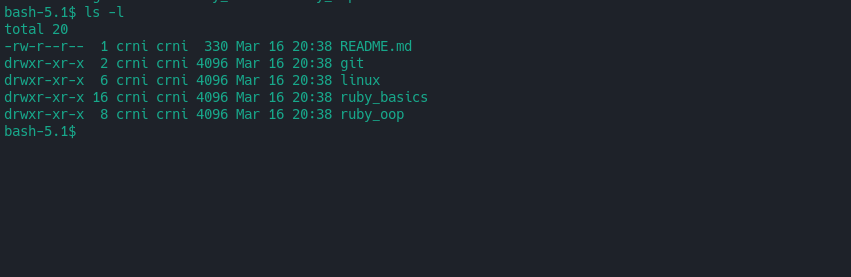
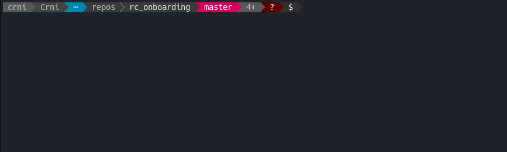

# Getting started with the terminal

Here we'll cover how to get around in the shell, see what's available around you and general things to look out for when using any terminal program.

Without much futher delay, here's what you might be greeted with when you start a terminal on any Linux machine:


Not really pretty, right?

On any modern Linux distribution, you're probably more likely to encounter something like this:


This provides a lot more useful information than it might seem at first glance.
It tells you which `user` is connected to the machine on which `host` and the current directory you're in.
Let's try getting that information ourselves!

To get the `user`, you can do two different things at this level:
- use the `whoami` command
- use `echo $USER`



Both of those command do the same thing as you can see, the difference is that one is using the `whoami` program, and the other is just printing the environment variable.
We'll get to envrionment variables later.

Similarly, to get the `host` or the name of the machine we're working on, we can do:
- `hostname`
- `echo $HOSTNAME` -> your mileage may vary based on the distribution, some allow just `$HOST` for this information



Also similarly to the examples above, we can get the `current directory` by executing:
- `pwd`
- `echo $PWD`



**But wait, this looks different from the prompt I get by default!** you might say.
Yes, that's correct, I'm leaving that out intentionally right now to keep things simpler, I'll cover that in a later chapter, but if you'd like to replicate the exact same output (printing only the current directory, and not the whole path, you can do `echo ${PWD}/*/\//`).

At this point, you've probably asked yourself **How do I print stuff in this???**.
Well, you've already seen examples of that, but you can print more or less anything with `echo`:
`echo "Hey there. :D" # prints out "Hey there. :D"` 

You can print things without spaces no problems, but when you want to print out something with spaces, be sure to use `'` or `"`.

Also a thing to note here, if you want to print environment variables, make sure you're using the `$` to let the terminal know you're asking for the value, and aren't using a string literal, unless you want to scream on yourself:


Now that we've covered the basics of finding out who and where we are and which machine we're using, let's get to navigating!
This is acomplished using the `cd` command!
You can think of it as a mnemonic for `**c**hange **d**irectory` or `**c**urrent **d**irectory`, whichever you prefer.

Let's try going one directory up from where we are, and then back into the directory where we last were:


You can also chain directories if they're related, so from the example above, even `cd ../../repos/rc_onboarding/` would put you in the same directory where you were, but it can be used to navigate to anywhere else as well.

With that out of the way, let's try seeing what files or even, other directories are in our current directory using `ls`:


But that's not very nice, we can't really tell what's a file and what's a directory from that, so let's try using `ls -l`:


This still doesn't give any clear information on what's a file and what isn't, but if you have sharp eyes, you'll notice a difference.
See how `README.md` has `-rw-r--r--` at the start of its line, unlike `drwxr-xr-x` on the other lines?
Those are the permissions of that file, but the `d` at the start of those denotes a `directory` instead.

We'll get to file permissions at a later point, but this is a way of telling them apart for the moment.

To end this chapter, let's finish by making the terminal prompt a bit prettier to make things less confusing later on.

One of the most useful things to have is a prompt with some colors, just in case you're running a command that blurts out a lot of text, so you can find it easier.
I'd highly recommend using the powerline shell by b-ryan on any Linux machine.

The short install script for that is:
```
# for the powerline shell
git clone https://github.com/b-ryan/powerline-shell
cd powerline-shell
python setup.py install

# for the poweline fonts
# clone
git clone https://github.com/powerline/fonts.git --depth=1
# install
cd fonts
./install.sh
# clean-up a bit
cd ..
rm -rf fonts
```

**Note** that you might need to install [patched powerline fonts](https://github.com/powerline/powerline/raw/develop/font/PowerlineSymbols.otf).

And after some tinkering around with the fonts, your prompt should look like this:


[Click here to got back to the Linux basics chapter](../)

[Click here to go to the next chapter](../file_permissions)
